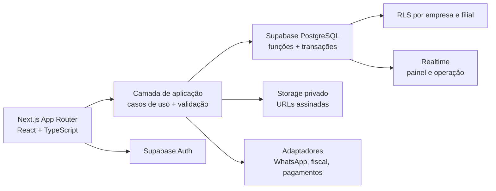
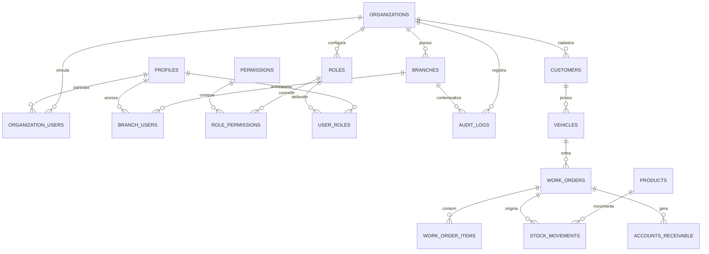

# Arquitetura do Motora ERP

## 1. Arquitetura proposta

O produto adota um monólito modular em Next.js com App Router. A interface e os fluxos server-side compartilham tipos e regras; o Supabase concentra autenticação, PostgreSQL, RLS, Storage, Realtime e funções transacionais. Integrações externas entram por adaptadores, sem acoplamento aos módulos de domínio.



Decisões centrais:

- `organization_id` é a fronteira principal de isolamento; `branch_id` refina escopo operacional.
- Autorização é verificada no banco. A interface apenas reflete as permissões retornadas.
- Cálculos, numeração, estoque e financeiro serão confirmados por funções transacionais.
- Exclusão operacional é lógica; auditoria é append-only.
- Leituras grandes usam paginação, filtros e índices no servidor.

## 2. Mapa dos módulos

| Domínio | Módulos | Fase |
| --- | --- | --- |
| Plataforma | autenticação, empresas, filiais, usuários, RBAC, auditoria, configurações | 1 |
| Operação | clientes, veículos, agenda, recepção, inspeção, orçamento, OS, painel | 2 |
| Suprimentos | serviços, produtos, estoque, reservas, fornecedores, compras, inventário | 3 |
| Financeiro | contas, caixa, pagamentos, fluxo, comissões, DRE | 4 |
| Relacionamento | CRM, portal, garantias, frotas, automações, BI, integrações | 5 |

## 3. Modelo de permissões

RBAC configurável em quatro dimensões: usuário, papel, empresa e filial. Uma atribuição sem filial vale para toda a empresa; com filial, vale apenas para a unidade informada.

```text
usuário -> user_roles -> papel -> role_permissions -> permissão
                     |                                   |
              empresa/filial                       módulo.ação
```

Papéis iniciais: proprietário, administrador e somente leitura. Os demais papéis do prompt serão presets editáveis, não enums fixos. Permissões usam códigos estáveis como `work_orders.create`, `inventory.move` e `financial.view`.

## 4. Principais entidades



As entidades operacionais a partir de `customers` entram nas migrations das fases seguintes; a fundação já estabelece as chaves e funções que elas reutilizarão.

## 5. Estrutura de pastas

```text
app/                     rotas, layouts e Server Components
components/              componentes de interface e formulários
lib/supabase/            clientes browser/server e sessão
supabase/migrations/     schema versionado, RLS e funções
docs/                    arquitetura, implantação e regras
tests/                   testes unitários e de integração
public/                  ativos públicos
```

Quando os domínios crescerem, cada um receberá `features/<dominio>/{components,queries,schemas,actions}` para manter baixo acoplamento.

## 6. Plano de migrations

1. `foundation`: organizações, filiais, perfis, memberships, RBAC, sequências, auditoria, helpers e RLS.
2. `customers_vehicles`: clientes, contatos, endereços, tags, veículos e documentos.
3. `appointments_inspections`: agenda, recursos, recepção e checklists.
4. `estimates_work_orders`: orçamentos versionados, aprovações, OS, itens e apontamentos.
5. `inventory_purchasing`: produtos, saldos, reservas, movimentos, fornecedores e compras.
6. `financial`: títulos, transações, caixas, formas de pagamento e comissões.
7. `crm_portal`: interações, garantias, frotas, portal, notificações e integrações.

Cada migration inclui índices, constraints, RLS e testes de isolamento correspondentes.

## 7. Etapas de desenvolvimento

- Fase 1: concluir sessão, convites, troca de empresa/filial, telas de RBAC e consulta de auditoria.
- Fase 2: implementada a base ponta a ponta cliente -> veículo -> check-in -> inspeção -> orçamento -> OS, com os fluxos detalhados evoluindo de forma incremental.
- Fase 3: ligar reserva e baixa de estoque aos eventos configurados da OS.
- Fase 4: gerar contas e movimentos financeiros pela origem, com estorno rastreável.
- Fase 5: portal, CRM, garantias, frotas, BI e adaptadores externos.

Nenhuma fase é encerrada sem build, RLS, testes de isolamento, responsividade e auditoria das ações críticas.
